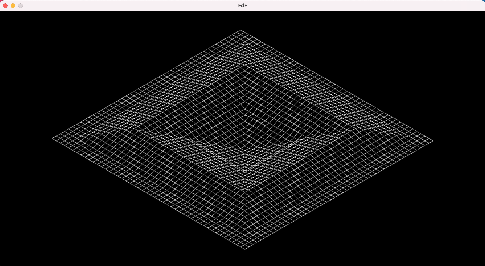
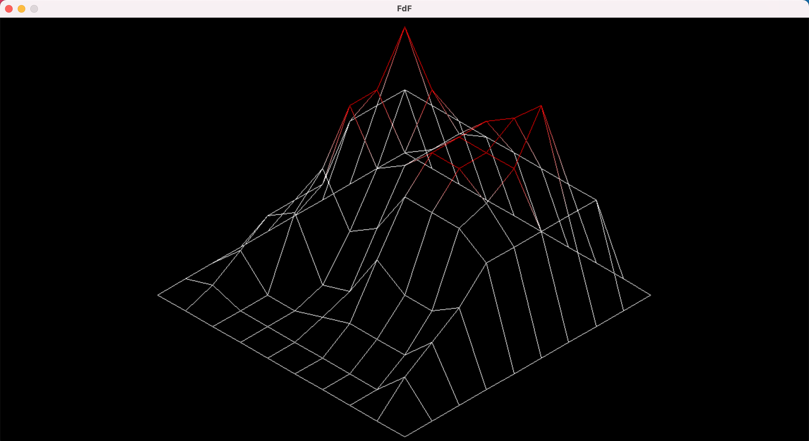
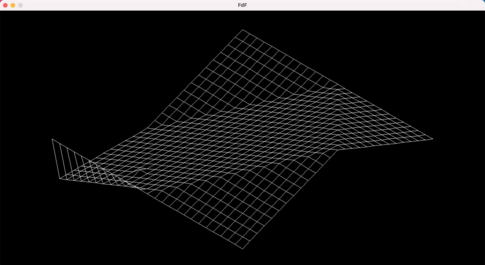
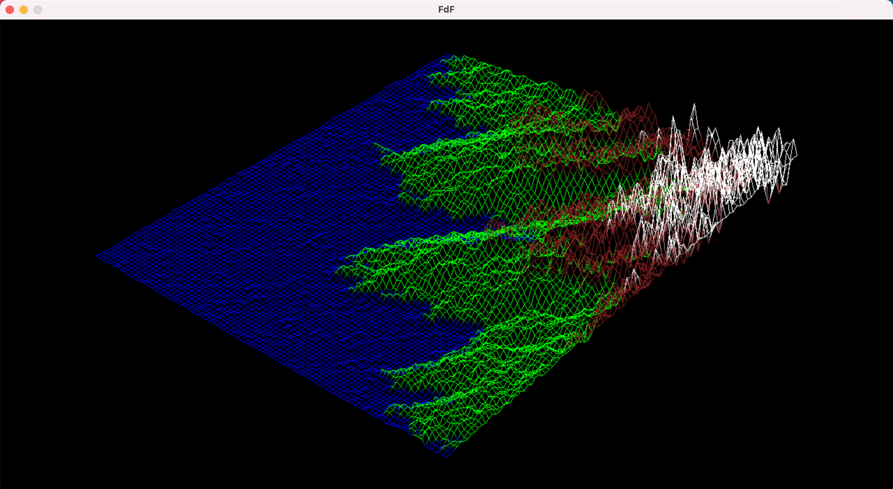
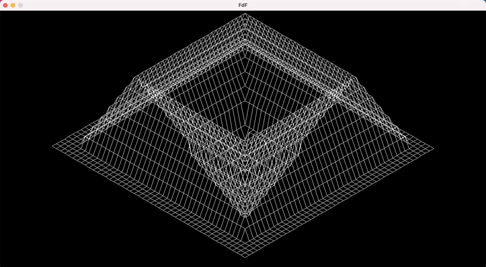

# FdF
FdF is a 42 graphic project. It's a simple wireframe 3D representation of a landscape. Example landscape maps are stored in the `maps` folder.

**Usage:**
1. clone repo
2. `make` for static image, or `make bonus` for interactive image.
3. execute programme with: `./fdf <mapfilename>`

**How to interact with FdF:**
* `W`, `A`, `S` and `D` keys for translation movement.
* `up arrow` and `down arrow` to change altitude.
* `scroll` up and down with your mouse to zoom in and out.
* `esc` to quit programme.

## Examples

